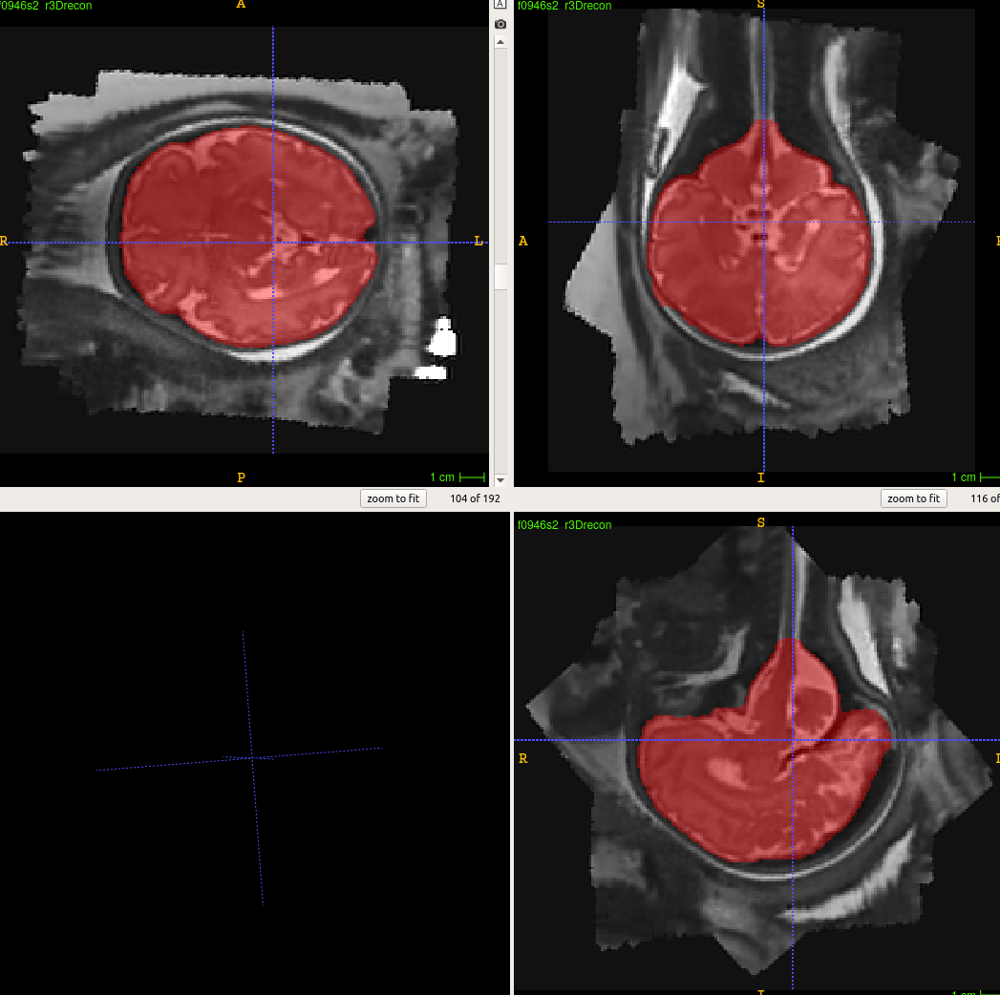

This is a model for segmentation of brain in fetal T2  MR images.

A trained model can downloaded and run on your images using the following two lines, where in the second line IMG_DIR should be replaced with your local directory where your images have been saved.

docker pull davoodk/brain_extraction

docker run   --mount src=/IMG_DIR/,target=/src/test_images/,type=bind  brain_extraction:1.0

Example results

  

